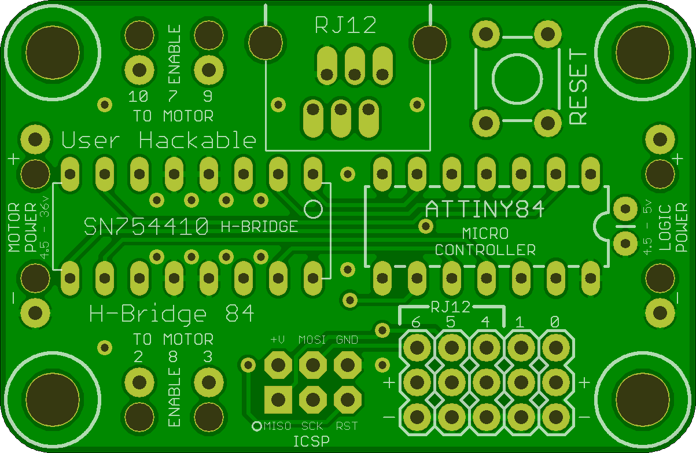
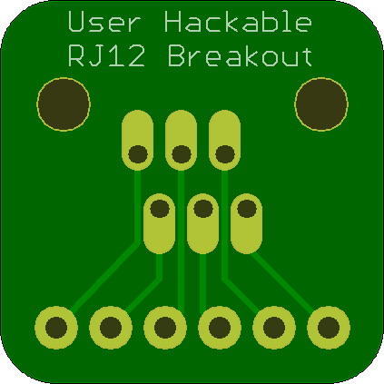
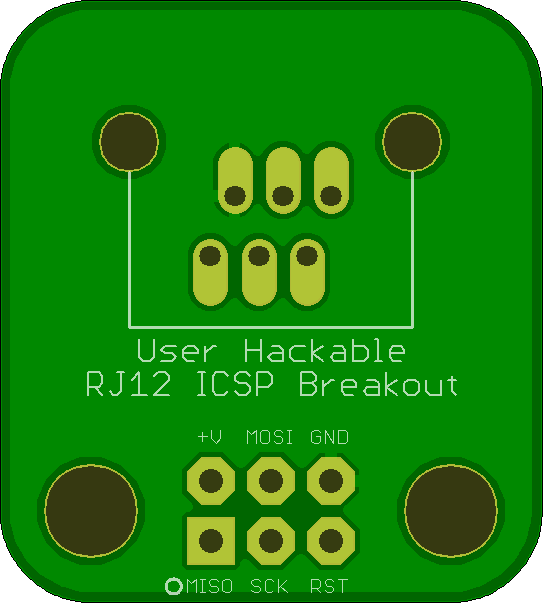

## HBridge84 

### Board dimensions

* (200000, 130000) original units
* (2.0000, 1.3000) inches
* (50.8000, 33.0200) mm

| Front | Back |
| --- | --- |
|  |  |

## RJ11Breakout 

### Board dimensions

* (70000, 70000) original units
* (0.7000, 0.7000) inches
* (17.7800, 17.7800) mm

| Front | Back |
| --- | --- |
|  |  |

## RJ11-ICSP-Breakout 

### Board dimensions

* (120000, 90625) original units
* (1.2000, 0.9062) inches
* (30.4800, 23.0187) mm

| Front | Back |
| --- | --- |
|  |  |

