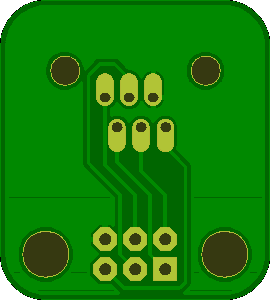

## RJ11-ICSP-Breakout 

### Board dimensions

* (120000, 90625) original units
* (1.2000, 0.9062) inches
* (30.4800, 23.0187) mm

| Front | Back |
| --- | --- |
|  |  |

## RJ11-ICSP-Breakout 

### Board dimensions

* (90625, 100000) original units
* (0.9062, 1.0000) inches
* (23.0187, 25.4000) mm

| Front | Back |
| --- | --- |
|  |  |

